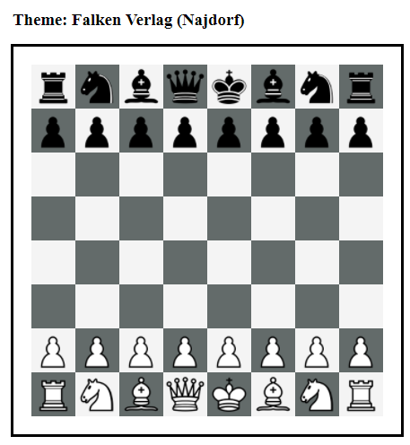

# PgnViewerJS

PgnViewerJS is a simple JavaScript implementation to show PGN files 
(Portable Game Notation == Chess)
in a web page. There are some tools out there, a lot of them with nice
functionality, but none of them met all my expectations, so this is a try
to meet them all. 

PgnViewerJS does not write everything anew, but it uses the following libraries:

* [chess.js](https://github.com/jhlywa/chess.js) Base library to model 
  chess in JavaScript
* [chessboardjs](https://github.com/oakmac/chessboardjs) Chess board that has
 all functionality to display chess positions, move pieces, ...
* [pegjs](https://github.com/pegjs/pegjs) Parser Generator implemented in Javascript.
  Used to translate the grammer file `pgn-rules.peg` into a Javascript representation.

See the working examples on my new GitHub Pages site [PgnViewerJS](http://mliebelt.github.io/PgnViewerJS/), especially the [Configuration Builder](http://mliebelt.github.io/PgnViewerJS/docu/example/config.html) that demonstrates all parameters in a running example.

## Example Screenshots

The following are example screenshots with the configuration set below, to show the rich possibilities of PgnViewerJS.

  

The screenshots show from left to right:

* `mode: board; theme: falken; showNotation: false`
* `mode: view; showNotation: false; showFen: true` with comment
* `mode: edit; orientation: black; locale: de` with comments

# Development and Releases

* The current snapshot will be the content of the `master` branch.
* Use the GitHub `Download ZIP` functionality to get the current snapshot, and build it for yourself.
* Or go to the [github.io pages](http://mliebelt.github.io/PgnViewerJS/) (documentation), where the current (and former) versions will be available.

## Release Content

* Unpack the release  locally in a new directory.
* Open the file `readme.html` in your favorite browser.
* Click on the 4 examples for the 4 modes: Board, View, Print and Edit.

## Snapshot Content

* When downloading a snapshot, you have 2 options:
  * Work directly with the sources. So starting a local web server on the root of the snapshot allows you to browse all examples in the directory `examples`.
  * Build a new release (including the documentation) by running `grunt` on the commandline. You will have to run first `npm install` to ensure all tools have the necessary version locally.

# Features

This implementation has the following features:

* Allows to show one chess game complete, with a lot of different styles, themes, tuning, ...
* Allows to play through the games forward and backward, including variations.
* Allows to play from a legal position only legal moves, and adds these moves to the notation (in a different style)
* Allows to play through by
  * clicking on moves
  * clicking on next and previous button
  * clicking on play button
  * using cursor left and right on the keyboard
* Allows to add moves to a game, when in the right 'mode'.  
* Knows all PGN notation elements, and knows how to render them.  

# Interface

There are 2 parts to the interface:

   * How does the UI work?
   * How is this viewer used?

## UI modes

There are four different kind of usages:

* pgnView renders the whole game, and allows to play it through, jump to any position.
* pgnEdit is a superset of pgnView, that allows to additional add variations,
change the order of main line and variations, and allows all other kind of
interactions that are possible: adding comments, PGN notation elements, whatever.
* pgnBoard will just show a position without any interaction possible.
* pgnPrint will just show a whole chess game, without any interaction possible.

There is at the moment no way to save a game that was edited in `pgnEdit` mode. But
you may at least copy the whole notation, and insert it again in the HTML code of
your web page.

## Using the viewer

To use the viewer in an HTML page, you have to do the following steps:

* Include the necessary libraries (should be as short as possible)
* Include the necessary CSS files
* Include the necessary div container for rendering of the 
   board and the moves
* Include some simple JavaScript code inside your HTML page.
   
So a rough template will look like:

    <!DOCTYPE html>
        <head>
            <link href="dist/css/pgnvjs.css" rel="stylesheet">
            
        </head>
        <body>
            

               
        </body>
    </html>

## Public site
    
See the documentation on the public site [PgnViewerJS](http://mliebelt.github.io/PgnViewerJS/docu/index.html)
for the current state, some working examples, and a little bit as background. This
site is growing, and allows me to show the early alpha implementation to others.

### Available versions

I will provide downloads of the versions, that should be easy to install. Just unpack
locally, and copy one of the examples and play with them.

* [Version 0.9.5](https://s3.eu-central-1.amazonaws.com/pgnviewerjs/releases/PgnViewerJS-0.9.5.zip): Some more fixes, stability.
* [Version 0.9.4](https://s3.eu-central-1.amazonaws.com/pgnviewerjs/releases/PgnViewerJS-0.9.4.zip): Finished edit mode, cleanup, some more fixes.
* [Version 0.9.3](https://s3.eu-central-1.amazonaws.com/pgnviewerjs/releases/PgnViewerJS-0.9.3.zip): Allows special markup, some more bug fixes.
* [Version 0.9.2](https://s3.eu-central-1.amazonaws.com/pgnviewerjs/releases/PgnViewerJS-0.9.2.zip): Some more bug fixes, examples to all issues at [GitHub](https://github.com/mliebelt/PgnViewerJS/issues), added Changelog.md, started restructuring the sources.
* [Version 0.9.1](https://s3.eu-central-1.amazonaws.com/pgnviewerjs/releases/PgnViewerJS-0.9.1.zip): Some bug fixes, examples to all issues at [GitHub](https://github.com/mliebelt/PgnViewerJS/issues),
  some additional examples and a lot of fixes in the documentation.
* [Version 0.9.0](https://s3.eu-central-1.amazonaws.com/pgnviewerjs/releases/PgnViewerJS-0.9.0.zip): Nearly feature complete, roughly documented, stable enough to play with it.

## References

* http://fontawesome.io/: Nice icon font used for some buttons
* http://www.famfamfam.com/lab/icons/silk/: Used part of the icons in the UI
* http://en.wikipedia.org/wiki/Numeric_Annotation_Glyphs Definition of the NAGs (partly used)
* **TODO** Collect here all references that are used in the implementation. This is only fair to the many ones that have provided additional parts of the implementation.