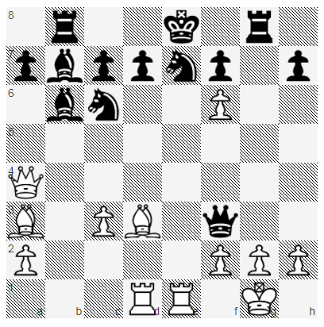
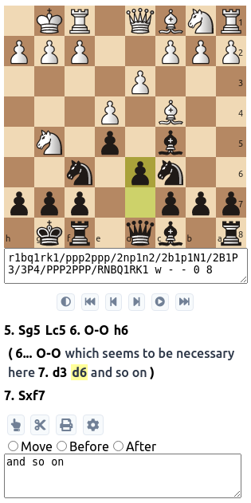
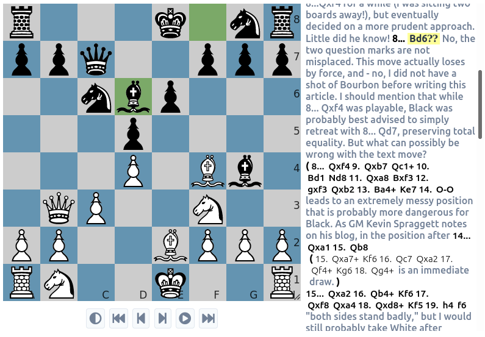

[](https://github.com/mliebelt/pgn-viewer/actions)
[](https://github.com/mliebelt/pgn-viewer/blob/main/LICENSE)
[]()
[](https://github.com/mliebelt/pgn-viewer/issues?q=is%3Aopen+is%3Aissue)
[](https://github.com/mliebelt/pgn-viewer/issues?q=is%3Aissue+is%3Aclosed)


# pgn-viewer

`pgn-viewer` is a simple JavaScript implementation to show PGN files (Portable Game Notation == Chess) in a web page. `pgn-viewer` does not write everything anew, but it uses the following libraries:

* [chess.js](https://github.com/jhlywa/chess.js) Base library to model chess in JavaScript
* [Chessground](https://github.com/ornicar/chessground) The chessboard used by lichess.org
* [pgn-reader](https://www.npmjs.com/package/@mliebelt/pgn-reader) Backend for the viewer (former part of this repository, now separate repo)
* [pgn-parser](https://github.com/mliebelt/pgn-parser) My own parser based on [peggy](https://github.com/peggyjs/peggy) (formerly pegjs)

See the section Acknowledgments for more supporting libraries.

See the working examples on my new GitHub Pages site [pgn-viewer](http://mliebelt.github.io/pgn-viewer/),
especially the [Configuration Builder](http://mliebelt.github.io/pgn-viewer/config/config.html) 
that demonstrates all parameters in a running example.

## Getting Started

The easiest way to use it is to install it by using NPM: `npm install @mliebelt/pgn-viewer`. You will find there the directory `lib` that contains everything. Copy that onto your webserver.

### Example Screenshots

The following are example screenshots with the configuration set below, to show the rich possibilities of pgn-viewer.





The screenshots show from left to right:

* `mode: board; theme: sportverlag`
* `mode: edit; headers: false; theme: 'brown'` with comments
* `mode: view; layout: 'left', pieceStyle: 'leipzig', theme: 'zeit'` with comments

Go to the [github.io pages](http://mliebelt.github.io/pgn-viewer/) (documentation), where the viewer is documented and shown.

### Features

This implementation has the following features:

* Allows to show one or many chess games complete, with a lot of different styles, themes, tuning, ...
* Allows to play through the games forward and backward, including variations.
* Allows to play from a legal position only legal moves.
* Knows all PGN notation elements, and knows how to render them.

### UI modes

There are four different kind of usages:

* `PGNV.pgnView` renders the whole game, and allows to play it through, jump to any position.
* `PGNV.pgnEdit` is a superset of pgnView, that allows to additional add variations, change the order of main line and variations, and other kind of interactions like adding comments, PGN notation elements, ...
* `PGNV.pgnBoard` will just show a position without any interaction possible.
* `PGNV.pgnPrint` will just show a whole chess game, without any interaction possible.
* `PGNV.pgnPuzzle` lets you solve a puzzle. If you play the right move of the underlying pgn, the opponent's move is played automatically and it is your turn again. Only the already played moves are shown to the user. The mode is new and the plan is to develop it further (e.g. giving hints)

There is at the moment no way to save a game that was edited in `pgnEdit` mode. But you may at least copy the whole notation, and insert it again in the HTML code of your web page.

## Running the tests

* Run `npm test`.

## Running the examples

* Start a local webserver (like `http-server`) inside the root directory, and visit the page `http://localhost:<port>/examples`. 
* Browse through the many examples in the sub-directories, or visit the configuration builder in directory `examples/configuration/config.html`. 

## Deployment

### From Release

* Copy the files from directory `lib` into a web server.
* Create new HTML files with the corresponding head and body.

### From Clone

* Clone the repository.
* Run `npm install` from the root, to ensure that all tools are installed. 
* Run `npm run build` in the root directory.
* Copy the files from the directory `lib`.
* Create new HTML files with the corresponding head and body.

### Using the viewer

#### Standalone script

To use the viewer in an HTML page, you have to do the following steps:

* Include the necessary library `pgnv.js`.
* Include the necessary div container for rendering of the  board and the moves.
* Include JavaScript code inside your HTML page to call the viewer.

So a rough template will look like:

```html
<!DOCTYPE html>
    <head>
        <script src="lib/dist.js" type="text/javascript" ></script>
    </head>
    <body>
        <div id="board"></div>
        <script>
    	PGNV.pgnView('board',{ pgn: '1. e4 e5 2. Nf3 Nc6 3. Bb5', pieceStyle: 'merida' });
        </script>
    </body>
</html>
```

See the example in [react.md](react.md) how to run the viewer in a react application.

## Built With

* [NPM](https://www.npmjs.com/) For libraries, building, ...
* [Webpack](https://webpack.js.org/) For building optimized bundle.

## Contributing

If you find something strange (bug), expect some feature (feature) or just want to comment on anything, please file first a ticket in Github.

If you want to help in implementing something, clone the repository, change whatever you want to, and provide a pull request that I can look at.

## Versioning and Roadmap

We use [SemVer](http://semver.org/) for versioning. For the versions available, see the [tags on this repository](https://github.com/mliebelt/pgn-viewer/tags).

From the version 1.0.0 on, the whole package can be downloaded / installed by using NPM:

* Download: `npm pack @mliebelt/pgn-viewer@1.5.9` Results in download of a file `mliebelt-pgn-viewer-1.5.9.tgz`, that contains in the directory `package/lib` all resources needed.
* Install: `npm install @mliebelt/pgn-viewer@1.5.9` as part of some other application. You will find then the files in the directory `node_modules/@mliebelt/pgn-viewer/lib`.

The roadmap is publicly documented in file [roadmap.md](./roadmap.md), and will be updated from time to time.

## Authors

* Markus Liebelt - [mliebelt](https://github.com/mliebelt)

## License

pgn-viewer is distributed under the **GPL-3.0 license** (or any later version, at your option), due to its use of [Chessground](https://github.com/ornicar/chessground).
When you use pgn-viewer for your website, your combined work may be distributed only under the GPL. **You must release your source code** to the users of your website.

Please read more about GPL for JavaScript on [greendrake.info/#nfy0](http://greendrake.info/#nfy0).

## Acknowledgments

We use the following libraries in the implementation:

* [chess.js](https://github.com/jhlywa/chess.js) Base library to model chess in JavaScript
* [Chessground](https://github.com/ornicar/chessground) The chessboard used by lichess.org
* [Mousetrap](https://craig.is/killing/mice) Binds keys to actions in the UI
* [roddeh-i18n](http://i18njs.com) Internationalization (== i18n) library to translate chess into current 18 languages. Strings are inlined in the library.
* [timer.ts](https://github.com/fschaefer/Timer.js) Small timer for automatic moves
* [FontAwesome](http://fontawesome.io/) Nice icon font used for some buttons
* [PGN Specification](https://github.com/mliebelt/pgn-spec-commented/blob/main/pgn-specification.md) PGN (Portable Game Notation) specification
* [NAG Specification](http://en.wikipedia.org/wiki/Numeric_Annotation_Glyphs) Definition of the NAGs (Numeric Annotation Glyphs)
* [PGN Specification  Supplement](https://github.com/mliebelt/pgn-spec-commented/blob/main/pgn-spec-supplement.md) Addition for adding graphical elements, clock values, eval, ...

Thank you a lot to all contributors of issues.

### Known Usage

* [PgnJS](https://github.com/xeyownt/mwpgnjs) Plugin for Mediawiki that uses pgn-viewer to display  chess games.
* [pgn-viewer-WP](https://github.com/mliebelt/pgn-viewer-WP) Plugin for Wordpress to show games with the help of pgn-viewer
* [The Chess Centre](https://github.com/chess-centre/platform#special-thanks-) Replaying games produced by DGT live boards following OTB events.
