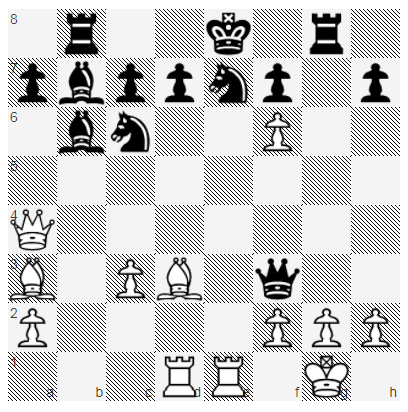
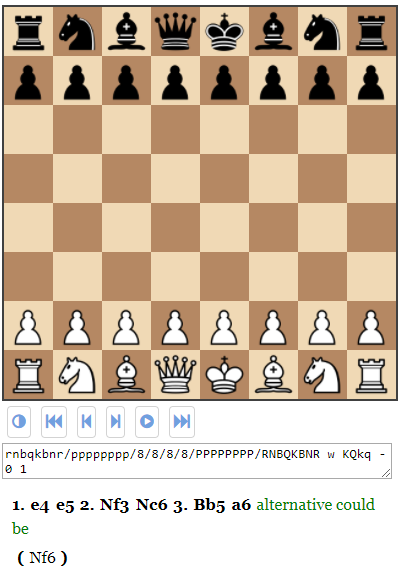
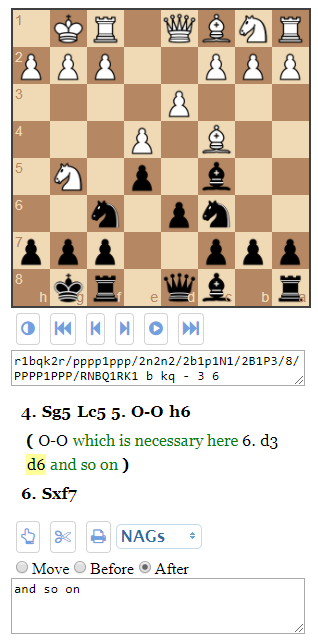

# PgnViewerJS

PgnViewerJS is a simple JavaScript implementation to show PGN files (Portable Game Notation == Chess)
in a web page. PgnViewerJS does not write everything anew, but it uses the following libraries:

See the working examples on my new GitHub Pages site [PgnViewerJS](http://mliebelt.github.io/PgnViewerJS/), especially the [Configuration Builder](http://mliebelt.github.io/PgnViewerJS/docu/example/config.html) that demonstrates all parameters in a running example.

## Getting Started

The easiest way to use it is to download a release, unpack that release, copy one of the examples HTLM files in `examples` (depending which mode you want to use), and modify them to your liking.

### Example Screenshots

The following are example screenshots with the configuration set below, to show the rich possibilities of PgnViewerJS.

The screenshots show from left to right:

* `mode: board; theme: sportverlag; pieceStyle: uscf`
* `mode: view; showNotation: false; showFen: true` with comment
* `mode: edit; orientation: black; locale: de` with comments

Go to the [github.io pages](http://mliebelt.github.io/PgnViewerJS/) (documentation), where the current (and former) versions will be available.

### Features

This implementation has the following features:

* Allows to show one chess game complete, with a lot of different styles, themes, tuning, ...
* Allows to play through the games forward and backward, including variations.
* Allows to play from a legal position only legal moves, and adds these moves to the notation (in a different style)
* Allows to play through by
  * clicking on moves
  * clicking on next and previous button
  * clicking on play button
  * using cursor left and right on the keyboard
* Allows to add moves to a game, when in the right 'mode'.
* Knows all PGN notation elements, and knows how to render them.

### UI modes

There are four different kind of usages:

* pgnView renders the whole game, and allows to play it through, jump to any position.
* pgnEdit is a superset of pgnView, that allows to additional add variations, change the order of main line and variations, and allows all other kind of interactions that are possible: adding comments, PGN notation elements, whatever.
* pgnBoard will just show a position without any interaction possible.
* pgnPrint will just show a whole chess game, without any interaction possible.

There is at the moment no way to save a game that was edited in `pgnEdit` mode. But
you may at least copy the whole notation, and insert it again in the HTML code of
your web page.

## Running the tests

* Clone the repository.
* Open the file `test/SpecRunner.html` and see if some tests break.

## Deployment

### From Release

* Copy the files from a release into a web server.
* Create new HTML files with the corresponding head and body.

### From Clone

* Clone the repository.
* Run `npm install` from the root, to ensure are tools are installed.
* Run `grunt default` to build a distribution.
* Copy the files from the directory `dist` (or `dist-nojq` for a variation without jQuery included).
* Create new HTML files with the corresponding head and body.

### Using the viewer

To use the viewer in an HTML page, you have to do the following steps:

* Include the necessary libraries.
* Include the necessary CSS files.
* Include the necessary div container for rendering of the
   board and the moves.
* Include JavaScript code inside your HTML page to call the viewer.

So a rough template will look like:

    <!DOCTYPE html>
        <head>
            <link href="dist/css/pgnvjs.css" rel="stylesheet">
            
        </head>
        <body>
            

            
        </body>
    </html>

## Built With

* [Grunt](https://gruntjs.com/) The Javascript builder
* [NPM](https://www.npmjs.com/) For boot-straping Grunt

## Contributing

If you find something strange (bug), expect some feature (feature) or just want to comment on anything, please file first a ticket in Github.

If you want to help in implementing something, clone the repository, change whatever you want to, and provide a pull request that I can look at.

## Versioning

We use [SemVer](http://semver.org/) for versioning. For the versions available, see the [tags on this repository](https://github.com/mliebelt/PgnViewerJS/tags).

Because not all people want to build on themselves, I keep the versions available for downloads:

* [Version 0.9.6](https://s3.eu-central-1.amazonaws.com/pgnviewerjs/releases/PgnViewerJS-0.9.6.zip): A lot of fixes, multi-line notation, stability.
* [Version 0.9.5](https://s3.eu-central-1.amazonaws.com/pgnviewerjs/releases/PgnViewerJS-0.9.5.zip): Some more fixes, stability.
* [Version 0.9.4](https://s3.eu-central-1.amazonaws.com/pgnviewerjs/releases/PgnViewerJS-0.9.4.zip): Finished edit mode, cleanup, some more fixes.
* [Version 0.9.3](https://s3.eu-central-1.amazonaws.com/pgnviewerjs/releases/PgnViewerJS-0.9.3.zip): Allows special markup, some more bug fixes.
* [Version 0.9.2](https://s3.eu-central-1.amazonaws.com/pgnviewerjs/releases/PgnViewerJS-0.9.2.zip): Some more bug fixes, examples to all issues at [GitHub](https://github.com/mliebelt/PgnViewerJS/issues), added Changelog.md, started restructuring the sources.
* [Version 0.9.1](https://s3.eu-central-1.amazonaws.com/pgnviewerjs/releases/PgnViewerJS-0.9.1.zip): Some bug fixes, examples to all issues at [GitHub](https://github.com/mliebelt/PgnViewerJS/issues),
  some additional examples and a lot of fixes in the documentation.
* [Version 0.9.0](https://s3.eu-central-1.amazonaws.com/pgnviewerjs/releases/PgnViewerJS-0.9.0.zip): Nearly feature complete, roughly documented, stable enough to play with it.

## Authors

* Markus Liebelt - [mliebelt](https://github.com/mliebelt)

## License

PgnViewerJS is licensed under the Apache license 2.0, see the [LICENSE.md](LICENSE.md) file for details.

## Acknowledgments

We use the following libraries in the implementation:

* [chess.js](https://github.com/jhlywa/chess.js) Base library to model chess in JavaScript
* [Chessground](https://github.com/ornicar/chessground) The chessboard used by lichess.org
* [pegjs](https://github.com/pegjs/pegjs) Parser Generator implemented in Javascript.
* [Choices.js](https://github.com/jshjohnson/Choices) A multiselect widget
* [Mousetrap](https://craig.is/killing/mice) Binds keys to actions in the UI
* [i18next](https://www.i18next.com/) Internationalization (== i18n) library to translate chess into current 18 languages.
* [Timer.js](https://github.com/fschaefer/Timer.js) Small timer for automatic moves
* [Underscore](http://underscorejs.org/) Tool belt for utility functions
* [FontAwesome](http://fontawesome.io/): Nice icon font used for some buttons
* [PGN Specification](http://www.saremba.de/chessgml/standards/pgn/pgn-complete.htm): PGN (Portable Game Notation) specification
* [NAG Specification](http://en.wikipedia.org/wiki/Numeric_Annotation_Glyphs) Definition of the NAGs (Numeric Annotation Glyphs)

Thank you a lot to all contributors of issues.

### Known Usage

* [PgnJS](https://github.com/xeyownt/mwpgnjs) Plugin for Mediawiki that uses PgnViewerJS to display  chess games.
* [PgnViewerJS-WP](https://github.com/mliebelt/PgnViewerJS-WP) Plugin for Wordpress to show games with the help of PgnViewerJS
